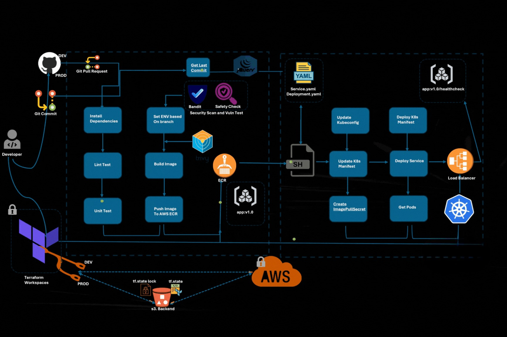
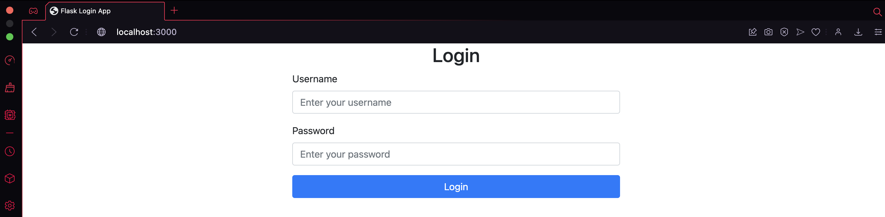
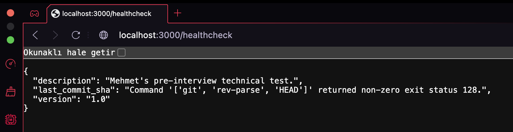

# CI/CD Project: Deploy a Python App with /healthcheck Endpoint on Docker, ECR, Kubernetes, Terraform, and GitHub Actions



### Table of Contents

1. [Introduction](#introduction)  
2. [Prerequisites](#prerequisites)  
3. [Key Technologies & Tools](#key-technologies--tools)  
4. [Pipeline Workflow Overview](#pipeline-workflow-overview)  
5. [Repository Structure](#repository-structure)  
6. [Setup and Configuration](#setup-and-configuration)  
7. [Local Build and Testing](#local-build-and-testing)  
8. [CI/CD Pipeline Implementation](#ci-cd-pipeline-implementation)  
9. [Kubernetes Configuration](#kubernetes-configuration)  
10. [Security Checks](#security-checks)  
11. [Branching Strategy](#branching-strategy)  
12. [Known Risks](#known-risks)  
13. [Final Testing and Push/Merge to Production](#final-testing-and-pushmerge-to-production)  
14. [Conclusion](#conclusion)

### Description

I was able to develop a CI/CD pipeline for a containerized Python application using GitHub Actions, Docker, AWS ECR, Kubernetes (EKS), and Terraform. The pipeline handled automatic builds, tests, security scans, and deployments to AWS EKS based on branch triggers (dev for staging, main for production) with `\healthcheck` endpoint that shows the last_commit_sha.

### Requirements

- Create a CI/CD pipeline that performs the following steps:
- Build and test a containerized Python application.
- Push Docker images to AWS Elastic Container Registry (ECR).
- Deploy the application to a Kubernetes cluster in AWS EKS using Terraform.
- Perform security scans using tools like Bandit, Safety, and Trivy.
- Deploy automatically upon commits to the dev or main branch in GitHub.
- Implement a `/healthcheck` endpoint that returns application version, description, and the last commit SHA in JSON format.

### Acceptance Criteria

- A functional GitHub Actions pipeline that builds, tests, and deploys based on branch (dev or main).
- Successful deployment of the Dockerized application to AWS EKS.
- Security scans are implemented, and reports are available for review.
- `/healthcheck` endpoint responds with accurate JSON data.
- Documentation is complete.

## Introduction

This guide walks you through how i was able to up a CI/CD pipeline for a containerized Python application. Using Docker, Terraform, GitHub Actions, Kubernetes, and AWS ECR, you will build, test, and deploy the application in an automated workflow. The goal is to enable automatic deployment on each new code commit.

## Prerequisites

Before beginning, ensure you have:
1. AWS Account with permissions for ECR and EKS.
2. GitHub Repository for version control and triggering the pipeline.
3. AWS CLI configured on your local machine.
4. Kubectl for Kubernetes management.
5. Terraform for provisioning infrastructure.
6. VS Code or any text editor of choice.

## Key Technologies & Tools

- **Docker**: For containerizing the Python application.
- **AWS ECR**: As the Docker image registry.
- **AWS EKS**: To deploy the containerized application in a Kubernetes cluster.
- **Terraform**: For provisioning EKS and related resources.
- **GitHub Actions**: For CI/CD, including building, testing, security scanning, and deployment.
- **Security Tools**: Trivy, Bandit, and Safety for scanning code and Docker images for vulnerabilities.

## Repository Structure

```
.
├── .github/
│   └── workflows/
│       └── cicdpipeline.yml
├── terraform/
│   ├── main.tf
│   └── variables.tf
├── app/
│   └── main.py
├── tests/
│   └── test_app.py
├── mng-app-local.sh
└── README.md
```

## CI/CD Pipeline Overview

The CI/CD pipeline executes the following steps:
1. Code Commit
2. Dependency Installation
3. Lint and Unit Test
4. Environment Configuration
5. Build Docker Image
6. Security Scans
7. Push to ECR
8. Update Kubernetes Config
9. Deploy to Kubernetes
10. Health Check

## Steps to Reproduce the Project

### 1. Clone the Repository

```bash
git clone https://github.com/oumngriel/mng-test-mod.git
cd mng-test-mod
```

### 2. Local Build and Testing

Run the provided script to build and test the application locally:

```bash
./mng-app-local.sh
```



Test the healthcheck endpoint:

```bash
curl http://localhost:3000/healthcheck
```




### 3. CI/CD Pipeline Implementation

- **Login to AWS**: Set up AWS credentials.
- **Use Terraform**: Initialize and create workspaces.

```bash
cd terraform
terraform init
terraform workspace new dev
terraform workspace new prod
terraform workspace select dev
terraform apply
```

- **GitHub Actions Workflow**: Create the `.github/workflows/cicdpipeline.yml` file with the pipeline configuration.

### 4. Create Secrets in GitHub

Add necessary secrets for AWS account and ECR repository names in your GitHub repository settings.

### 5. Pushing Changes to Dev Branch

Make changes and push to the `dev` branch to trigger the pipeline:

```bash
git checkout -b dev
git add .
git commit -m "Initial commit"
git push origin dev
```

## Key Pipeline Stages

1. **Build and Test**: Runs unit tests and linting.
2. **Security Scans**: Uses Bandit, Safety, and Trivy.
3. **Docker Image Creation**: Builds and pushes the image to ECR.
4. **Deployment**: Deploys to EKS and verifies health.

## Project Highlights

- Automated CI/CD workflow with GitHub Actions.
- Use of Terraform for infrastructure provisioning.
- Dockerized Python application with healthcheck endpoint.
- Comprehensive security checks for code and Docker images.
